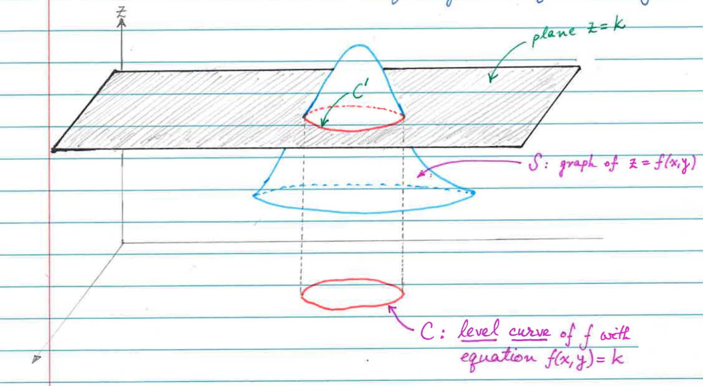
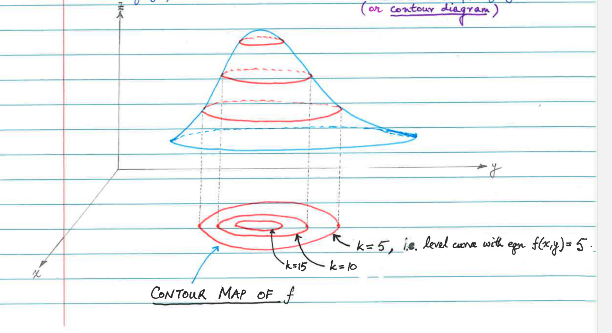

# Functions of Several Variables
## The Graph of a Function of Two Variables
- If $f$ is a function of two variables with Domain $D$, then the graph of $f$ is the collection of all points $(x, y, z)$ in $R^3$ such that $z = f(x, y)$ and $(x, y)$ is in $D$.
- In other words, the graph of $f$ is the surface $z = f(x, y)$.

## Level Curves
- Level curves are another tool that will help us visualize functions of two variables.
- A level curve of a function $f$ of two variables is a curve in $R^2$ with equation $f(x, y) = k$, where k is any real number in teh range of $f$.

## Sketching the Level Curves of  Function
- Begin by graphing a function $f(x, y)$. 
- Let $k$ be a number in the range of $f$.
  - $z=k$ is the equation of a "horizontal" plane that is parallel to the $xy$-plane.
- Intersect the graph of $f$ with the plane $z = k$. This yields a curve $C'$ in the $R^3$. When we project $C'$ onto the $xy$-plane, we obtain the level curve of $f$ where $f(x, y) = k.
- If we let $k$ vary over the range of $f$, we obtain a family of level curves. 
- We can vaguely describe the level curves through general shapes.
- EX: Given $z = 3x^2 + 5y^2$, describe the level curves.
  - Let $z = k$. Then $3x^2 + 5y^2 = k$. We know that this equation describes an ellipse when $k > 0$.
  - Description: The level curves of z are a collection of concentric ellipses.