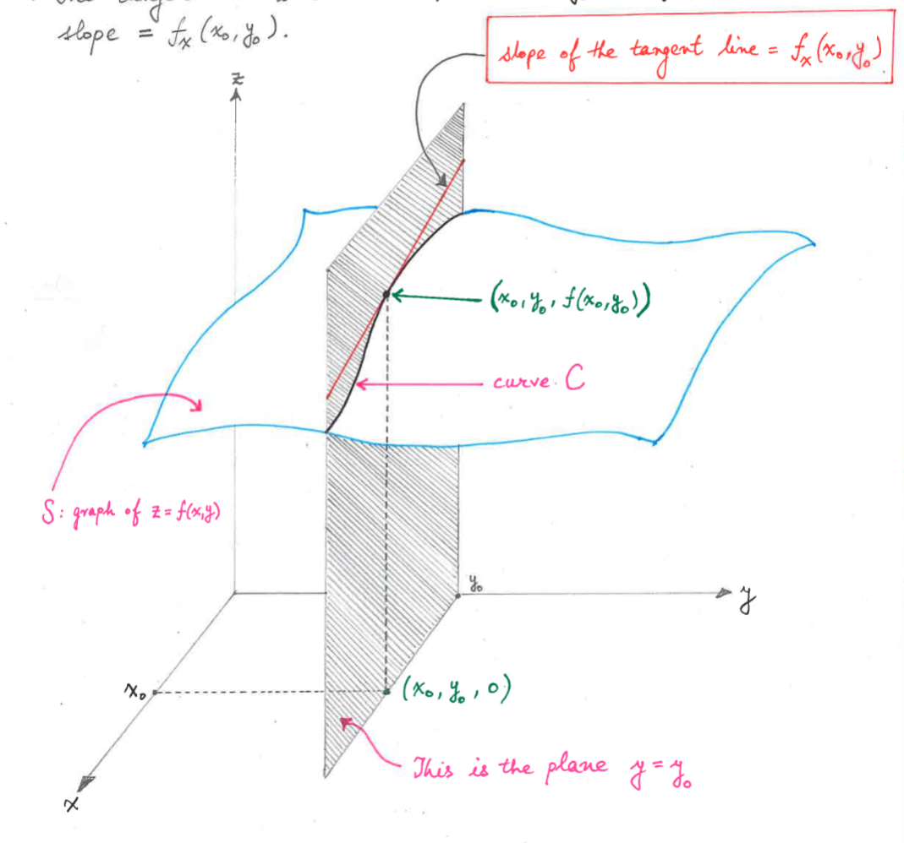

# Partial Derivatives
- If $(x_0, y_0)$ is in domain of $f$, the partial derivative of $f$ with respect to $x$ at $(x_0, y_0)$ is
  - $f_x(x_0, y_0) = \lim_{h \to 0} \frac{f(x_0 + h, y_0) - f(x_0, y_0)}{h}$, provided the limit exists.
- If $(x_0, y_0)$ is in domain of $f$, the partial derivative of $f$ with respect to $y$ at $(x_0, y_0)$ is
  - $f_y(x_0, y_0) = \lim_{h \to 0} \frac{f(x_0, y_0 + h) - f(x_0, y_0)}{h}$, provided the limit exists.
## Notation
- If $z=f(x, y)$, we write
  - $f_x(x, y) = \frac{\partial z}{\partial x} = \frac{\partial f}{\partial x} = \frac{\partial}{\partial x} f(x, y)$
  - $f_y(x, y) = \frac{\partial z}{\partial y} = \frac{\partial f}{\partial y} = \frac{\partial}{\partial y} f(x, y)$

## How to find the partial derivative $z = f(x, y)$
- To find $f_x$, treat $y$ as a constant and differentiate $f(x, y)$ with respect to $x$.
- To find $f_y$, treat $x$ as a constant and differentiate $f(x, y)$ with respect to $y$.

## Geometric Interpretation of $f_x(x_0, y_0)$
- Given a function #f(x, y)#, the graph of $z=f(x, y)$ is a surface in $\mathbb{R}^3$, which we will label $S$.
- Intersecting S with the plane $y=y_0$ results in a curve $C$, shown in black in the figure below.
- The Tangent line to $C$ at the point $(x_0, y_0, f(x_0, y_0))$ has slope $f_x(x_0, y_0)$.
  

## Partial Derivatives of 3 or more variables
- $f_x(x, y, z) = \lim_{h \to 0} \frac{f(x+h, y, z) - f(x, y, z)}{h}$, provided the limit exists.
- $f_y(x, y, z) = \lim_{h \to 0} \frac{f(x, y+h, z) - f(x, y, z)}{h}$, provided the limit exists.
- $f_z(x, y, z) = \lim_{h \to 0} \frac{f(x, y, z+h) - f(x, y, z)}{h}$, provided the limit exists.
- You can take derivatives with respect to any variable, but you must treat the other variables as constants. This is the same as how you take partial derivatives with respect to $x$ and $y$(two variables).

## Higher Order Derivatives
- $(f_{x})_x = \frac{\partial^2 f}{\partial x^2} = \frac{\partial}{\partial x} \left( \frac{\partial f}{\partial x} \right)$
- $(f_{x})_y = \frac{\partial^2 f}{\partial y \partial x} = \frac{\partial}{\partial y} \left( \frac{\partial f}{\partial x} \right)$
  - This is a mixed partial derivative. The order of the variables in the subscript does not matter.
- $(f_{y})_x = \frac{\partial^2 f}{\partial x \partial y} = \frac{\partial}{\partial x} \left( \frac{\partial f}{\partial y} \right)$
  - This is also a mixed partial derivative. The order of the variables in the subscript does not matter.
- $(f_{y})_y = \frac{\partial^2 f}{\partial y^2} = \frac{\partial}{\partial y} \left( \frac{\partial f}{\partial y} \right)$
- These four derivatives are called the second order partial derivatives of $f$.

## Clairaut's Theorem (equality of mixed partial derivatives)
- Let $f(x, y)$ be a function such that $f_{xy}$ and $f_{yx}$ are continuous on a disk $D$. Then, for every $(x, y)$ in $D$, $f_{xy}(x, y) = f_{yx}(x, y)$.
- In other words, the order of differentiation does not matter.