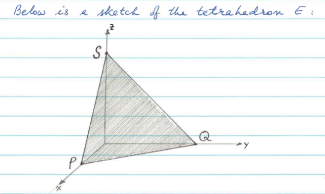

# 12.5
## Triple Integrals
- Assume that $f(x,y,z)$ is defined on a solid rectangular box $B$ in $\mathbb{R}^3$. Partition $B$ into "cubes" of volume $\Delta V_{ijk} = \Delta x_i \Delta y_j \Delta z_k$. Choose a sample point $(x_{ijk}^*, y_{ijk}^*, z_{ijk}^*)$ in each sub-box.
#### Example
$$\iiint_B x cos(y+z) dV$$
$$=\int_0^\pi \int_0^{\pi/2} \int_0^2 x cos(y+z) dx dy dz$$
$$=\int_0^\pi \int_0^{\pi/2} \left[ \frac{x^2}{2} cos(y+z) \right]_0^2 dy dz$$
$$=\int_0^\pi \int_0^{\pi/2} 2 cos(y+z) dy dz$$
$$=\int_0^\pi \left[ 2 sin(y+z) \right]_0^{\pi/2} dz$$
$$2[-cos(\frac{3\pi}2) + cos(\pi) + cos(\frac \pi 2) - cos(0)]$$
$$=2(-2)$$
$$=-4$$

## Simple Regions
- A solid region $E$ in $\mathbb{R}^3$  is **z-simple** if lines parallel to the z-axis have one entry point and one exit point in E.
  - There should be a line such that it enters and exist the region only once being parallel to the z-axis.
- A solid region $E$ in $\mathbb{R}^3$  is **y-simple** if lines parallel to the y-axis have one entry point and one exit point in E.
  - There should be a line such that it enters and exist the region only once being parallel to the y-axis.
- A solid region $E$ in $\mathbb{R}^3$  is **x-simple** if lines parallel to the x-axis have one entry point and one exit point in E.
    - There should be a line such that it enters and exist the region only once being parallel to the x-axis.

- The bounds of the inner most integral of the triple integral should be that line that enters and exits the region only once.

#### Example
Evaluate the triple intrgral $\iiint_E x dV$ where E is the solid tetrahedron with vertices $(0,0,0)$, $(2,0,0)$, $(0,6,0)$, and $(0,0,6)$.

We can set up the intrgral as follows:
$$\int_{x=0}^2 \int_{y=0}^{6-3x} \int_{z=0}^{6-3x-y} x dz dy dx$$

The bound for the x integral is simple.

The bounds for the y integral is set up by having the y component of the point $(0,6,0)$ and subtracting by $3x$ since 3 is the slope from $\frac 6 2 x$

The bounds for the z integral is set up by having the z component of the point $(0,0,6)$ and subtracting by $3x$ and $y$ since 3 is the slope from $\frac 6 2 x$ and $y$ is the slope from $\frac 6 6 y$

# 12.6
## Cylindrical Coordinates
- The coordinates are $(r, \theta, z)$
- $x = r cos(\theta)$
- $y = r sin(\theta)$
- $z = z$
- you integrate in the order: $dz dr d\theta$

## Spherical Coordinates
- The coordinates are $(\rho, \theta, \phi)$
- $x = \rho sin(\phi) cos(\theta)$
- $y = \rho sin(\phi) sin(\theta)$
- $z = \rho cos(\phi)$
- you integrate in the order: $d\rho d\phi d\theta$
- $\rho = \sqrt{x^2 + y^2 + z^2}$
- $\theta = arctan({\frac y x})$, $x \neq 0$
- $\phi = arccos({\frac z {\sqrt{x^2+y^2+z^2}}})$

# 12.7

# 13.1

# 13.2

# 13.3

# 13.4

